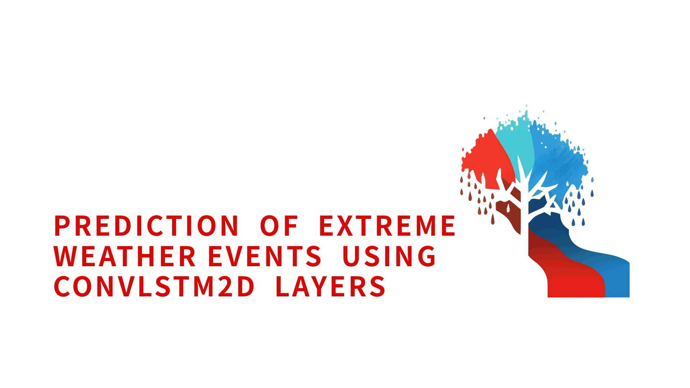

# **Weather Prediction App**

Link to web app:
[https://jye-lim-weather.streamlit.app/](https://jye-lim-weather.streamlit.app/)

Link to documentation:
[https://jye-lim.github.io/weather_prediction_app/](https://jye-lim.github.io/weather_prediction_app/)

## **Overview**

Welcome to our weather prediction web app! This web app demonstrates the capabilities of using a ConvLSTM2D model to predict extreme weather events across Singapore. Through this web app, we hope to showcase the potential of using Deep Neural Networks to capture spatiotemporal dependencies within meteorological datasets to predict the onset of extreme weather events.

The accuracy of the deployed models in this web app has much room for improvement. However, we hope that by sharing our findings and potential areas for future research, we can contribute to developing more reliable forecasting systems for Singapore.

The folder structure is as follows:

<p>
    ...</br>
    ├─── .streamlit</br>
    ├─── data</br>
    │&nbsp;&nbsp;&nbsp;└─── precipitation : <i>(data in .npy)</i></br>
    │&nbsp;&nbsp;&nbsp;└─── spi : <i>(data in .npy)</i></br>
    │&nbsp;&nbsp;&nbsp;└─── singapore_reservoirs.geojson</br>
    ├─── scripts</br>
    ├─── static</br>
    │&nbsp;&nbsp;&nbsp;└─── assets : <i>(coordinate and coastline data)</i></br>
    │&nbsp;&nbsp;&nbsp;└─── downloads : <i>(data in .csv)</i></br>
    │&nbsp;&nbsp;&nbsp;└─── images : <i>(images in .png)</i></br>
    │&nbsp;&nbsp;&nbsp;└─── videos : <i>(videos in .mp4)</i></br>
    ├─── .gitignore</br>
    ├─── app.py</br>
    ├─── LICENSE</br>
    ├─── README.md</br>
    └─── requirements.txt</br>
    ...
</p>

- data: Contains WRF simulated and predicted data for plotting
- scripts: Contains self-defined functions for the web app
- static: Contains files that remains unchanged

## **Installation**

To access the web app, clone the repo and follow the steps below to run it locally:

1. Create a virtual environment with `Python 3.10.6` and activate it.

    ```bash
    conda create -n wpa python=3.10.6
    conda activate wpa
    ```

2. Clone the repo.

    ```bash
    git clone https://github.com/jye-lim/weather_prediction_app
    ```

3. Navigate to the repo.

    ```bash
    cd weather_prediction_app
    ```

4. Install the required packages using the requirements.txt file.

    ```bash
    pip install -r requirements.txt
    ```

5. Run the app.py file

    ```bash
    streamlit run app.py
    ```

## **User Guide**

[](https://drive.google.com/file/d/1yCAS14LA8XYfnkKBLIfydlrSVGGSjyXb/preview)

## **Methodology**

The methodology for predicting extreme weather events in Singapore using the ConvLSTM2D model involves data pre-processing, model architecture design, and evaluation. We used the statistically downscaled data from [SgCALE's WRF dataset](https://sgcale.github.io/research/climate-downscaling/), and select relevant variables. The data is split into training, validation, and test sets and normalized based on the training set distribution.

A custom loss function, [Fractions Skill Score (FSS)](https://doi.org/10.48550/arXiv.2106.09757) loss, is employed to compute the model loss across an area rather than a pixel-to-pixel comparison. This approach prevents the model from being penalized twice for a reasonable prediction. The FSS loss is a mix of MSE and MAE losses, with weights of 0.70 and 0.30, respectively, and computes the average precipitation within a user-defined mask size before calculating the weighted losses between the true and predicted values.

## **Future Works**

1. **Data Scaling**

    Scale the predicted data to match the mean of our WRF Simulated values. Can be achieved by applying min-max scaling to the predicted dataset using the WRF Simulated values before adding or subtracting the scaled dataset to align the means.

2. **Improving the FSS Loss Function**

    Refine FSS loss to penalise the model from making "safe" predictions that avoid extreme values, such as 0 or extreme precipitation. This enhancement could better capture the onset of extreme weather events.

3. **Longer-term Forecasting**

    The ConvLSTM2D model currently does not perform well for longer-term forecasting. Future research could investigate potential improvements to the model architecture, additional meteorological features, or alternative machine-learning techniques to enhance the model's performance in this regard.

4. **Investigating Regional Errors**

    Our analysis revealed that the bottom-left corner of our area of interest has an unusually high error. Further investigation into the dataset for that location is warranted to determine if the data is reasonable. If reasonable, additional studies to understand why the model performs poorly in that specific location should be conducted.

5. **Categorical Prediction of SPI Classes**

    An alternative approach would be to adjust the ConvLSTM2D model to perform categorical prediction of SPI classes, yielding a probabilistic output of the events.

    During our study, we attempted to incorporate a SoftMax output layer for this purpose, but all iterations of the model performed poorly. This may be due to the significant reduction in the dataset count when daily data is resampled to monthly steps. We also tried incorporating weights based on the inverse class frequencies technique discussed earlier in the report, but this was also unsuccessful.

    Future research can explore the use of Bayesian probability to compute the weights for each class, potentially improving model performance in this context.

## **Contributing**

### Submitting code changes

- Submit an [Issue](https://github.com/jye-lim/weather_prediction_app/issues)
- Discuss the proposed changes with other users and the maintainers
- Open a [Pull Request](https://github.com/jye-lim/weather_prediction_app/pulls)
- Ensure all CI tests pass
- Provide instructions to check the effect of the changes
- Await code review

## **Disclaimers**

The data and predictions presented in this dashboard are for informational purposes only and should not be used for decision-making without further verification. The creators of this dashboard are not responsible for any errors or inaccuracies in the data or predictions or for any decisions made based on the information provided here.
